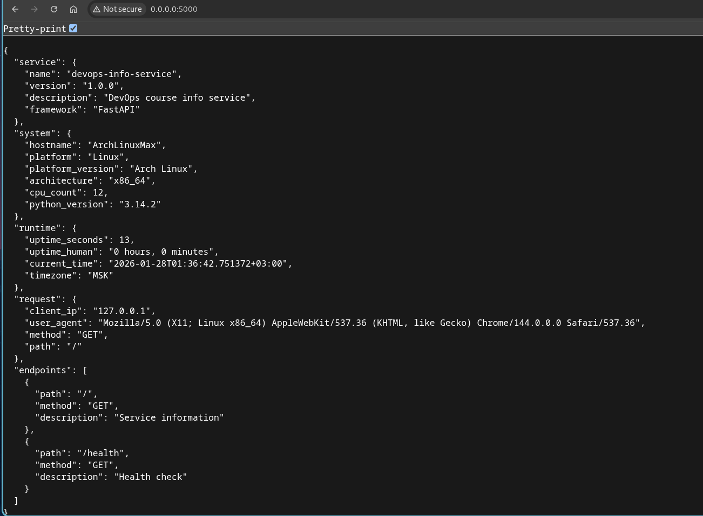
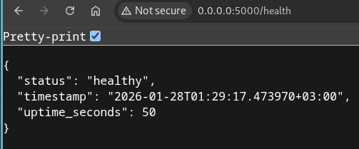
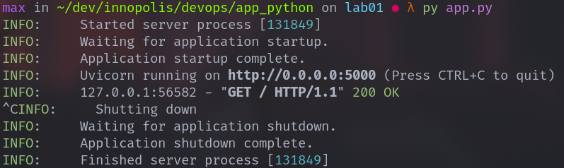

# DevOps Engineering — Lab 01
## DevOps Info Service (Python)

**Student:** Maxim Fomin
**Email:** m.fomin@innopolis.university

---

## 1. Framework Selection

### Chosen Framework: FastAPI

For this lab, **FastAPI** was selected as the web framework for implementing the DevOps Info Service.

**Reasons for choosing FastAPI:**
- Provides modern features such as built-in support for asynchronous request handling
- Very fast to develop with minimal boilerplate
- Automatic request validation and OpenAPI documentation
- Familiarity with the framework reduced development time
- Well-suited for API-centric services like this one

Frameworks such as Django were intentionally avoided, as they introduce unnecessary complexity and overhead for a small informational service.

### Framework Comparison

| Framework | Pros | Cons | Verdict |
|--------|-----|------|--------|
| **FastAPI** | Async support, automatic docs, high performance, clean API design | Slightly higher learning curve than Flask | ✅ Chosen |
| Flask | Lightweight, simple, flexible | No async by default, manual validation | Not selected |
| Django | Full-featured, ORM, admin panel | Heavyweight, excessive for this task | Not suitable |

---

## 2. Best Practices Applied

### Clean Code Organization

- Application logic is clearly structured and readable
- Functions have descriptive names and single responsibilities
- Imports are grouped and ordered correctly
- Code formatting is enforced using **Ruff**

**Importance:**
Clean code improves readability, maintainability, and reduces onboarding time for other developers.

---

### Dependency Management

All dependencies are pinned to exact versions in [requirements.txt](../requirements.txt).
Pinned dependencies ensure reproducible builds and prevent unexpected breaking changes.

---

### Configuration via Environment Variables

The application is configurable using environment variables such as `HOST`, `PORT`, and `DEBUG`.

```python
host = os.getenv("HOST", "0.0.0.0")
port = int(os.getenv("PORT", 5000))
debug = os.getenv("DEBUG", "False").lower() == "true"
```

Environment-based configuration is a core DevOps practice that allows the same application to run in different environments without code changes.

---

### Error Handling & Logging

Explicit error handlers were not added manually, as **FastAPI provides robust default exception handling and structured error responses out of the box**.

Relying on framework-level error handling reduces boilerplate and ensures consistent API responses.

---

## 3. API Documentation

### `GET /` — Main Endpoint

Returns detailed information about the service, system, runtime, request metadata, and available endpoints.

**Example request:**
```bash
curl http://localhost:5000/
```

**Example response:**
```json
{
  "service": {
    "name": "devops-info-service",
    "version": "1.0.0",
    "description": "DevOps course info service",
    "framework": "FastAPI"
  },
  "system": {
    "hostname": "ArchLinuxMax",
    "platform": "Linux",
    "platform_version": "Arch Linux",
    "architecture": "x86_64",
    "cpu_count": 12,
    "python_version": "3.14.2"
  },
  "runtime": {
    "uptime_seconds": 4,
    "uptime_human": "0 hours, 0 minutes",
    "current_time": "2026-01-28T01:28:30.792062+03:00",
    "timezone": "MSK"
  },
  "request": {
    "client_ip": "127.0.0.1",
    "user_agent": "Mozilla/5.0 (X11; Linux x86_64) AppleWebKit/537.36 (KHTML, like Gecko) Chrome/144.0.0.0 Safari/537.36",
    "method": "GET",
    "path": "/"
  },
  "endpoints": [
    {
      "path": "/",
      "method": "GET",
      "description": "Service information"
    },
    {
      "path": "/health",
      "method": "GET",
      "description": "Health check"
    }
  ]
}
```

---

### `GET /health` — Health Check

Returns the health status and uptime of the service.

**Example request:**
```bash
curl http://localhost:5000/health
```

**Example response:**
```json
{
  "status": "healthy",
  "timestamp": "2026-01-28T01:29:17.473970+03:00",
  "uptime_seconds": 50
}
```

This endpoint always returns HTTP `200` while the service is operational.

---

## 4. Testing Evidence

The application was tested locally using a web-browser.

### Testing Commands

```bash
python app.py
```

### Screenshots Included

The following screenshots are provided in `docs/screenshots/`:

1. 
2. 
3. 

---

## 5. Challenges & Solutions

1. - C: Documenting all details in the report and the service's README.md
   - S: Use an LLM, then read&edit the result.

## 6. GitHub community


**Why Stars Matter:**

**Discovery & Bookmarking:**
- Stars help you bookmark interesting projects for later reference
- Star count indicates project popularity and community trust
- Starred repos appear in your GitHub profile, showing your interests

**Open Source Signal:**
- Stars encourage maintainers (shows appreciation)
- High star count attracts more contributors
- Helps projects gain visibility in GitHub search and recommendations

**Professional Context:**
- Shows you follow best practices and quality projects
- Indicates awareness of industry tools and trends

**Why Following Matters:**

**Networking:**
- See what other developers are working on
- Discover new projects through their activity
- Build professional connections beyond the classroom

**Learning:**
- Learn from others' code and commits
- See how experienced developers solve problems
- Get inspiration for your own projects

**Collaboration:**
- Stay updated on classmates' work
- Easier to find team members for future projects
- Build a supportive learning community

**Career Growth:**
- Follow thought leaders in your technology stack
- See trending projects in real-time
- Build visibility in the developer community

**GitHub Best Practices:**
- Star repos you find useful (not spam)
- Follow developers whose work interests you
- Engage meaningfully with the community
- Your GitHub activity shows employers your interests and involvement
