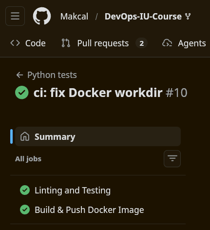

# Lab 03 — CI/CD

**Student:** Maxim fomin

**Email:** m.fomin@innopolis.university

---

## 1. Unit (integration) tests

### Tests description

I chose `pytest` as it is most popular and easy to use. So, all tests can be run with a single word `pytest`. Use `--cov` to collect code coverage. An optional flag `-v` can be added to see tests' names.
```bash
pip install -r requirements-dev.txt
pytest --cov=src --cov=main --cov-fail-under=85
```

As the task suggested, I provided two test: one for each endpoint validating the response structure. Although, it would be more intelligent to assign this task on strong type system (e.g. use Pydantic structures).

### Example output
```
============================== test session starts ==============================
platform linux -- Python 3.14.2, pytest-9.0.2, pluggy-1.6.0
rootdir: /home/max/dev/innopolis/devops/app_python
plugins: anyio-4.12.1, cov-7.0.0
collected 2 items

tests/test_endpoints.py ..                                                [100%]

================================ tests coverage =================================
________________ coverage: platform linux, python 3.14.2-final-0 ________________

Name                      Stmts   Miss  Cover
---------------------------------------------
main.py                      13      1    92%
src/__init__.py               0      0   100%
src/routes/__init__.py        0      0   100%
src/routes/health.py          9      0   100%
src/routes/root.py            8      0   100%
src/statistics.py            37      3    92%
tests/__init__.py             0      0   100%
tests/test_endpoints.py      15      0   100%
---------------------------------------------
TOTAL                        82      4    95%
=============================== 2 passed in 0.49s ===============================
```

---

## 2. CI workflow

My workflow consists of two jobs: one to test and one, dependent, to build a docker image. For these tasks I used official Python and Docker actions from GitHub's collection. The steps are classical: first, get all dependencies, then test/build. Also, I picked semantic versioning, since my app is not bounded to a periodic release strategy, and it is more widespread among opensource projects.

### Evidence of correctness

[Link](https://github.com/Makcal/DevOps-IU-Course/actions/runs/21948389022)



---
