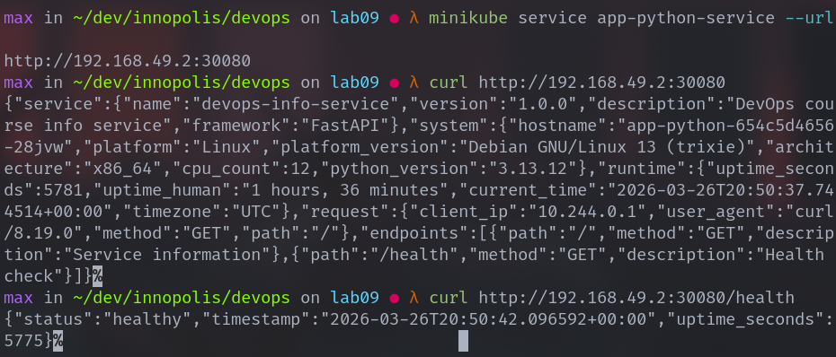
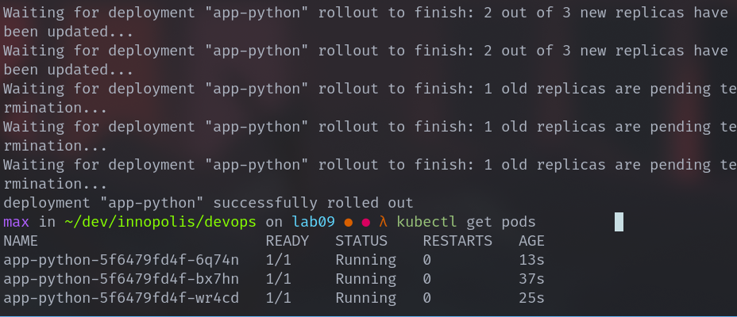

# Lab 9 — Kubernetes Fundamentals

## Architecture Overview

This lab demonstrates deploying a containerized Python application to Kubernetes using a declarative configuration approach.

### Architecture Description

The deployment consists of:

* **1 Deployment** managing **3 replicas** of the Python application
* **1 Service (NodePort)** exposing the application externally
* **Health probes** ensuring application reliability
* **Resource limits** protecting cluster stability

### Traffic Flow

Client → NodePort Service → Deployment → Pods (3 replicas)

### Resource Allocation Strategy

Each container is configured with:

* **CPU request:** 100m
* **CPU limit:** 200m
* **Memory request:** 128Mi
* **Memory limit:** 256Mi

This ensures:

* Efficient scheduling
* Protection from resource exhaustion
* Stable cluster performance

---

# Manifest Files

## deployment.yml

This file defines the Kubernetes Deployment responsible for managing application Pods.

### Key Configuration Choices

**Replicas**

```yaml
replicas: 3
```

Reason:

* Ensures high availability
* Allows load distribution
* Provides redundancy if one Pod fails

---

**Rolling Update Strategy**

```yaml
strategy:
  type: RollingUpdate
  rollingUpdate:
    maxSurge: 1
    maxUnavailable: 0
```

Reason:

* Ensures zero downtime updates
* New Pod created before old one removed

---

**Resource Limits**

```yaml
resources:
  requests:
    cpu: "100m"
    memory: "128Mi"
  limits:
    cpu: "200m"
    memory: "256Mi"
```

Reason:

* Prevents excessive resource usage
* Helps Kubernetes scheduler allocate workloads properly

---

**Health Checks**

```yaml
livenessProbe:
  httpGet:
    path: /health
    port: 5000
```

```yaml
readinessProbe:
  httpGet:
    path: /health
    port: 5000
```

Reason:

* Liveness probe restarts failed containers
* Readiness probe ensures traffic only goes to ready containers

---

## service.yml

This file defines a NodePort Service that exposes the application.

### Key Configuration Choices

**Service Type**

```yaml
type: NodePort
```

Reason:

* Allows external access in local clusters
* Suitable for development environments

---

**Port Mapping**

```yaml
port: 8000
targetPort: app-http
nodePort: 30080
```

Reason:

* External traffic enters through port 30080
* Forwarded internally to the named container port (5000)

---

# Deployment Evidence

## Apply Manifests

```bash
kubectl apply -f k8s/deployment.yml
kubectl apply -f k8s/service.yml
```

---

## Cluster Resources

```bash
kubectl get all
```

```text
NAME                              READY   STATUS    RESTARTS   AGE
pod/app-python-654c5d4656-28jvw   1/1     Running   0          92m
pod/app-python-654c5d4656-5t6qt   1/1     Running   0          91m
pod/app-python-654c5d4656-wjtz4   1/1     Running   0          92m

NAME                         TYPE        CLUSTER-IP      EXTERNAL-IP   PORT(S)          AGE
service/app-python-service   NodePort    10.99.254.191   <none>        8000:30080/TCP   134m
service/kubernetes           ClusterIP   10.96.0.1       <none>        443/TCP          173m

NAME                         READY   UP-TO-DATE   AVAILABLE   AGE
deployment.apps/app-python   3/3     3            3           134m

NAME                                    DESIRED   CURRENT   READY   AGE
replicaset.apps/app-python-654c5d4656   3         3         3       92m
replicaset.apps/app-python-68959dd5b6   0         0         0       134m
```

---

## Pod and Service Details

```bash
kubectl get pods
```

```text
NAME                          READY   STATUS    RESTARTS   AGE
app-python-654c5d4656-28jvw   1/1     Running   0          93m
app-python-654c5d4656-5t6qt   1/1     Running   0          93m
app-python-654c5d4656-wjtz4   1/1     Running   0          93m
```

---

## Deployment Description

```bash
kubectl describe deployment app-python
```

```text
Name:                   app-python
Namespace:              default
CreationTimestamp:      Thu, 26 Mar 2026 21:31:24 +0300
Labels:                 app=app-python
Annotations:            deployment.kubernetes.io/revision: 2
Selector:               app=app-python
Replicas:               3 desired | 3 updated | 3 total | 3 available | 0 unavailable
StrategyType:           RollingUpdate
MinReadySeconds:        0
RollingUpdateStrategy:  0 max unavailable, 1 max surge
Pod Template:
  Labels:  app=app-python
  Containers:
   app-python:
    Image:      makcal3000/iu-devops-app_python:latest
    Port:       5000/TCP (app-http)
    Host Port:  0/TCP (app-http)
    Limits:
      cpu:     200m
      memory:  256Mi
    Requests:
      cpu:         100m
      memory:      128Mi
    Liveness:      http-get http://:5000/health delay=5s timeout=1s period=5s #success=1 #failure=3
    Readiness:     http-get http://:5000/health delay=5s timeout=1s period=3s #success=1 #failure=3
    Environment:   <none>
    Mounts:        <none>
  Volumes:         <none>
  Node-Selectors:  <none>
  Tolerations:     <none>
Conditions:
  Type           Status  Reason
  ----           ------  ------
  Available      True    MinimumReplicasAvailable
  Progressing    True    NewReplicaSetAvailable
OldReplicaSets:  app-python-68959dd5b6 (0/0 replicas created)
NewReplicaSet:   app-python-654c5d4656 (3/3 replicas created)
Events:
  Type    Reason             Age   From                   Message
  ----    ------             ----  ----                   -------
  Normal  ScalingReplicaSet  95m   deployment-controller  Scaled up replica set app-python-654c5d4656 from 0 to 1
  Normal  ScalingReplicaSet  95m   deployment-controller  Scaled down replica set app-python-68959dd5b6 from 3 to 2
  Normal  ScalingReplicaSet  95m   deployment-controller  Scaled up replica set app-python-654c5d4656 from 1 to 2
  Normal  ScalingReplicaSet  95m   deployment-controller  Scaled down replica set app-python-68959dd5b6 from 2 to 1
  Normal  ScalingReplicaSet  95m   deployment-controller  Scaled up replica set app-python-654c5d4656 from 2 to 3
  Normal  ScalingReplicaSet  94m   deployment-controller  Scaled down replica set app-python-68959dd5b6 from 1 to 0
```

---

## Application Access Test



---

# Operations Performed

## Scaling Deployment

Scaled to 5 replicas:

```bash
kubectl scale deployment/app-python --replicas=5
```

Verification:

```bash
kubectl get pods
```

Result: 5 Running Pods

---

## Rolling Update

Updated image version:

```yaml
image: makcal3000/iu-devops-app_python:new
```

Applied update:

```bash
kubectl apply -f k8s/deployment.yml
```

Watched rollout:

```bash
kubectl rollout status deployment/app-python
```

Result:



---

## Rollback

Checked rollout history:

```bash
kubectl rollout history deployment/app-python
```

Performed rollback:

```bash
kubectl rollout undo deployment/app-python
```

Result:

Previous stable version restored.

---

# Production Considerations

## Health Checks Strategy

The application includes:

* **Liveness Probe**

  * Detects crashed or stuck containers
  * Automatically restarts unhealthy Pods

* **Readiness Probe**

  * Prevents traffic routing to unavailable Pods
  * Ensures stable request handling

Health endpoint used:

```http
GET /health
```

---

## Resource Limits Rationale

Limits were selected based on:

* Small Python web service workload
* Local cluster environment
* Preventing container memory exhaustion

Future production improvements:

* Adjust based on real usage metrics
* Use Horizontal Pod Autoscaler (HPA)

---

## Security Improvements

Future production upgrades may include:

* Running containers as non-root user
* Using Network Policies
* Implementing Secrets management
* Enabling Pod Security Standards

---

## Monitoring and Observability

Future integration includes:

* Metrics collection using Prometheus
* Visualization using Grafana
* Log aggregation using Loki

These components were configured in previous labs.

---

# Challenges & Solutions

## Issue 1 — Pods Not Starting

**Problem**

Pods entered:

```text
CrashLoopBackOff
```

**Cause**

Missing `/health` endpoint.

**Solution**

Added:

```python
@app.get("/health")
def health():
    return {"status": "ok"}
```

---

## Issue 2 — Service Not Accessible

**Problem**

Application could not be accessed externally.

**Cause**

Port mismatch between:

* containerPort (8000)
* targetPort

**Solution**

Aligned ports:

```yaml
containerPort: 5000
targetPort: 5000
```

---

# What I Learned

This lab introduced key Kubernetes concepts including:

* Declarative deployment using YAML
* Pod lifecycle management
* Service-based networking
* Application scaling
* Rolling updates and rollbacks

The Kubernetes reconciliation model ensures that the desired state defined in manifests is continuously maintained.

This demonstrates how Kubernetes enables reliable, scalable container orchestration in production environments.

