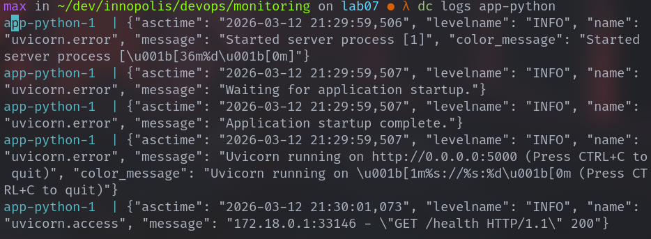
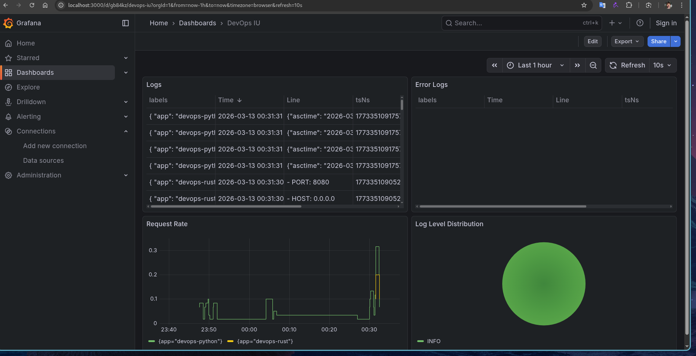
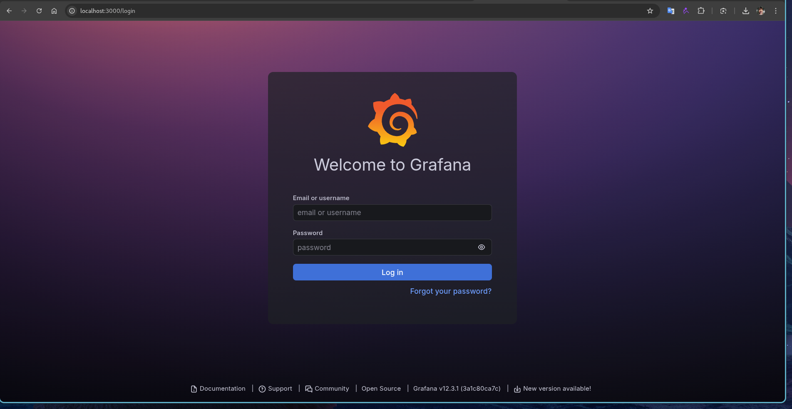

# DevOps Engineering Lab 07 --- Observability & Logging with Loki Stack

**Student:** Maxim Fomin\
**Course:** DevOps Core\
**Topic:** Logging & Observability with Loki, Promtail, and Grafana

------------------------------------------------------------------------

# 1. Architecture

This lab implements centralized logging using the Grafana Loki stack.

Components:

-   Loki --- log storage and indexing
-   Promtail --- log collector that sends logs to Loki
-   Grafana --- visualization and log exploration UI
-   Application containers --- services generating logs

Pipeline:

Application Containers → Promtail → Loki → Grafana

Promtail reads Docker container logs and attaches metadata labels (e.g.,
container name and application name).\
Loki stores logs using the TSDB storage engine with schema v13,
optimized for high-performance queries.\
Grafana queries Loki using LogQL.

------------------------------------------------------------------------

# 2. Setup Guide

Project structure:

```
monitoring/
├── docker-compose.yml
├── loki/config.yml
├── promtail/config.yml
└── docs/LAB07.md
```

Deployment steps:
```bash
cd monitoring docker compose up -d docker compose ps
```

Verify services:

Test Loki:
```bash
curl http://localhost:3100/ready
```

Check Promtail targets:
```bash
curl http://localhost:9080/targets
```

Open Grafana:
```bash
http://localhost:3000
```

Add Loki data source: Connections → Data Sources → Loki\
URL: http://loki:3100

------------------------------------------------------------------------

# 3. Configuration

## Loki

Key configuration:

-   HTTP server on port 3100
-   TSDB storage backend
-   Filesystem object storage
-   Schema version v13
-   Log retention: 7 days (168h)

Example snippet:

schema_config: configs: - from: 2024-01-01 store: tsdb object_store:
filesystem schema: v13

TSDB provides faster queries and improved compression.

------------------------------------------------------------------------

## Promtail

Promtail collects logs from Docker containers using Docker service
discovery.

Key sections:

Server: server: http_listen_port: 9080

Positions: positions: filename: /tmp/positions.yml

Loki client: clients: - url: http://loki:3100/loki/api/v1/push

Docker discovery: docker_sd_configs: - host: unix:///var/run/docker.sock

Relabeling example: relabel_configs: - source_labels:
\['\_\_meta_docker_container_name'\] regex: '/(.\*)' target_label:
container

------------------------------------------------------------------------

# 4. Application Logging

The Python application logs are structured in JSON format using
python-json-logger.

Example JSON log:

```json
{ "timestamp": "2026-03-13T15:30:01", "level": "INFO", "message":
"request", "method": "GET", "path": "/health", "status_code": 200 }
```



------------------------------------------------------------------------

# 5. Dashboard

A Grafana dashboard contains four panels.

Logs table: `{app=~"devops-.*"}`

Request rate: `sum by (app) (rate({app=~"devops-.*"}[1m]))`

Error logs: `{app=~"devops-.*"} | json | level="ERROR"`

Log level distribution: `sum by (level)
(count_over_time({app=~"devops-.*"} | json [5m]))`



------------------------------------------------------------------------

# 6. Production Configuration

Resource limits example:
```yaml
deploy:
  resources:
    limits:
      cpus: '1.0'
      memory: 1G
    reservations:
      cpus: '0.5'
      memory: 512M
```

Security: Anonymous Grafana access disabled.



Health checks example:
```yaml
healthcheck:
  test: ["CMD-SHELL", "wget --spider -q http://localhost:3100/ready || exit 1"]
  interval: 10s
  retries: 5
```

------------------------------------------------------------------------

# 7. Testing

Generate logs:
```bash
for i in {1..20}; do curl http://localhost:8000/; done
```

Verify logs: `{app="devops-python"}`

Parse JSON: `{app="devops-python"} | json`

------------------------------------------------------------------------

# 8. Challenges

Adapting FastAPI to JSON logging.

------------------------------------------------------------------------

# Conclusion

The Loki stack provides an efficient centralized logging solution.\
Promtail collects logs from containers, Loki stores them with labels,
and Grafana enables powerful querying and visualization.
