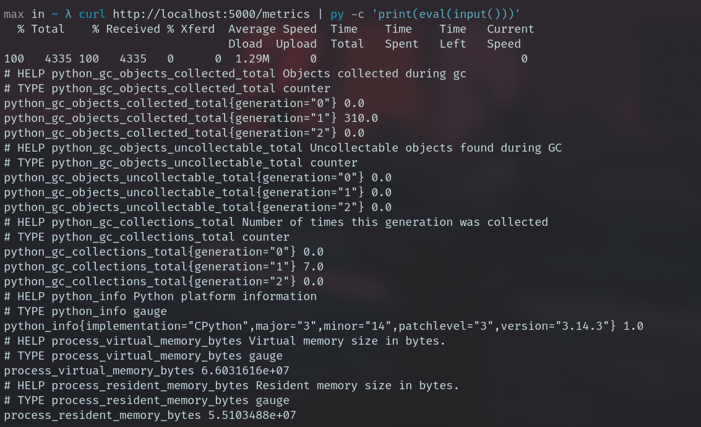
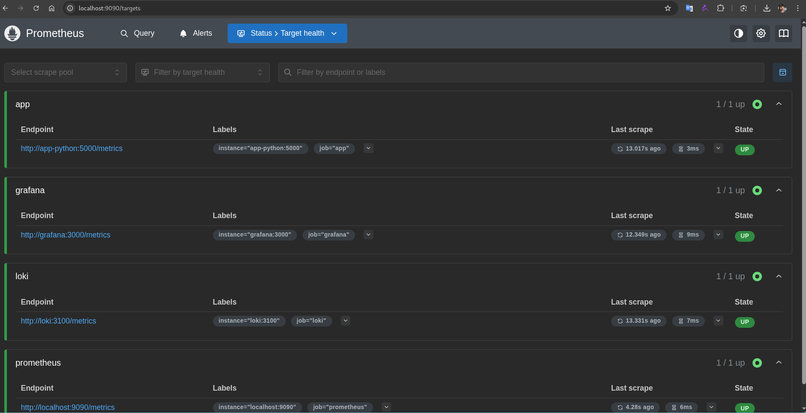
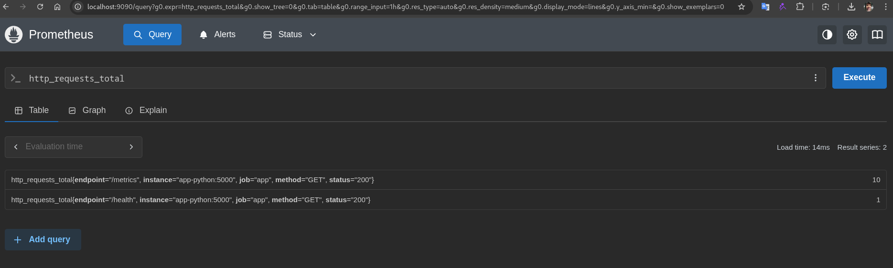
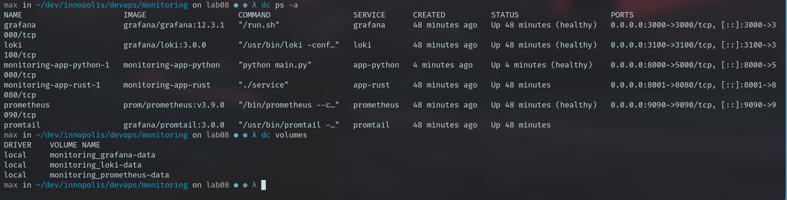

# LAB08 --- Metrics & Monitoring with Prometheus

## 1. Architecture

Application exposes /metrics → Prometheus scrapes → Grafana visualizes.

## 2. Application Instrumentation

Implemented: - Counter: http_requests_total - Gauge:
http_requests_in_progress - Histogram: http_request_duration_seconds

Labels used: method, endpoint, status.

## 3. Prometheus Configuration

-   Scrape interval: 15s
-   Targets:
    -   prometheus:9090
    -   app-python:8000
    -   loki:3100
    -   grafana:3000
-   Retention: 15d / 10GB

## 4. Dashboard

Panels: - Request Rate → rate(http_requests_total\[5m\]) - Error Rate →
rate(http_requests_total{status=\~"5.."}\[5m\]) - p95 latency →
histogram_quantile - Heatmap → request duration buckets - Active
requests → gauge - Status distribution → sum by(status)

## 5. PromQL Examples

-   rate(http_requests_total\[5m\])
-   sum(rate(http_requests_total\[5m\]))
-   histogram_quantile(0.95,
    rate(http_request_duration_seconds_bucket\[5m\]))
-   up == 0
-   sum by(status)(rate(http_requests_total\[5m\]))

## 6. Production Setup

-   Health checks enabled
-   Resource limits configured
-   Persistent volumes used
-   Retention configured

## 7. Testing and evidences

[prometheus.yml](../prometheus/prometheus.yml)
```yml
global:
  scrape_interval: 15s
  evaluation_interval: 15s

# Storage settings (Prometheus 3.x style)
storage:
  tsdb:
    retention:
      time: 15d
      size: 10GB

scrape_configs:
  # Prometheus self-monitoring
  - job_name: 'prometheus'
    static_configs:
      - targets: ['localhost:9090']

  # Your Python app (metrics endpoint)
  - job_name: 'app'
    metrics_path: /metrics
    static_configs:
      - targets: ['app-python:5000']

  # Loki metrics
  - job_name: 'loki'
    metrics_path: /metrics
    static_configs:
      - targets: ['loki:3100']

  # Grafana metrics
  - job_name: 'grafana'
    metrics_path: /metrics
    static_configs:
      - targets: ['grafana:3000']
```

[Grafana Dashboard JSON](../grafana_prometheus.json)

-   curl /metrics works
-   Prometheus targets UP and query example
-   Grafana dashboards show live data







## 8. Challenges

- Grafana dashboard customization
