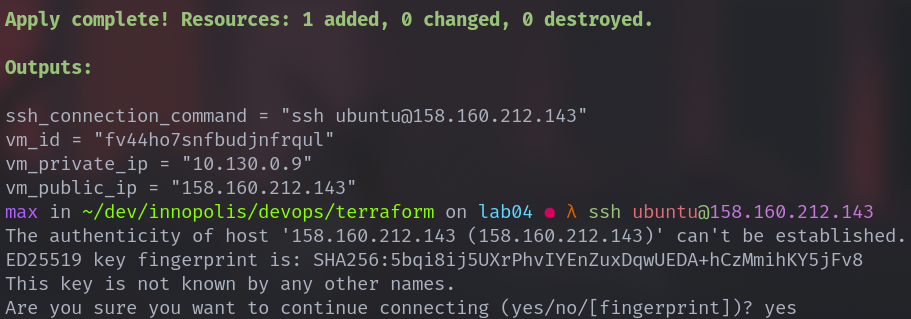
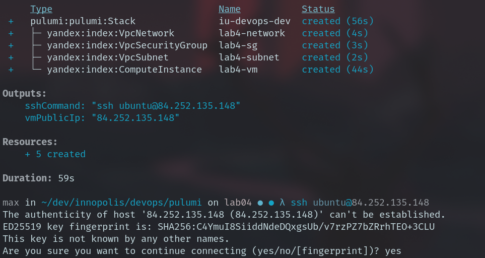
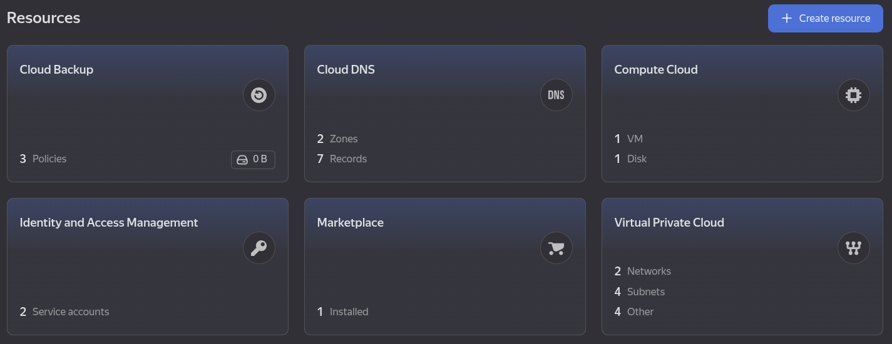

# LAB04 --- Infrastructure as Code (Terraform & Pulumi)

## 1. Cloud Provider & Infrastructure

### Cloud Provider

For this lab, I used **Yandex Cloud**.\
It was chosen because it provides a free-tier virtual machine and is
accessible without requiring international billing setup.

### Authentication

Authentication was configured using a **service account JSON key**
(`terraform-key.json`).\
The key was generated in Yandex Cloud Console after creating a service
account with the required permissions.

The most challenging part of the setup was navigating Yandex Cloud
documentation to correctly create and assign permissions to the service
account.

### Infrastructure Configuration

**Zone:** `ru-central1-d`\
**OS:** Ubuntu 24.04 LTS (family: ubuntu-2404-lts-oslogin)

**VM Specs (Free Tier):** - 2 cores - 20% core fraction - 1 GB RAM - 10
GB network-hdd disk

**Network Components Created:** - VPC network - Subnet
(`10.130.0.0/24`) - Security group - Public NAT IP (enabled via
`nat = true`)

### Security Group Rules

-   SSH (22) --- open to `0.0.0.0/0`
-   HTTP (80) --- open to `0.0.0.0/0`
-   App port (5000) --- open to `0.0.0.0/0`
-   All outbound traffic allowed

For simplicity in the lab environment, SSH was not restricted to a
specific IP.

------------------------------------------------------------------------

## 2. Terraform Implementation

### Project Structure

    terraform/
    ├── main.tf
    ├── variables.tf
    ├── outputs.tf
    ├── terraform.tfvars (gitignored)
    ├── terraform-key.json (gitignored)
    └── .gitignore

### Resources Created

-   `yandex_vpc_network`
-   `yandex_vpc_subnet`
-   `yandex_vpc_security_group`
-   `yandex_compute_instance`
-   Data source for Ubuntu image

### Key Design Decisions

-   Used variables for cloud_id, folder_id, zone, and SSH key path.
-   Used labels for resource identification.
-   Enabled NAT for public access.
-   Used free-tier CPU guarantee (core_fraction = 20).

### State Management

State file was kept **locally**. `.tfstate`, `.terraform/`, JSON keys
and tfvars were excluded via `.gitignore`.

### Challenges

The main difficulty was correctly configuring Yandex Cloud
authentication and generating the service account JSON key. Once
configured, Terraform provisioning worked smoothly.

### Result

Infrastructure was successfully created.\
VM was accessible via:

    ssh ubuntu@<public_ip>

------------------------------------------------------------------------

## 3. Pulumi Implementation

### Migration Process

After completing Terraform, infrastructure was destroyed using:

    terraform destroy

All resources were confirmed deleted in the Yandex Cloud console.

### Initial Attempt --- Python

I initially attempted to use Pulumi with Python.

However, the `pulumi-yandex` package depended on `pkg_resources`, which
was removed in Python 3.12. This caused dependency resolution errors and
prevented the project from running correctly.

Due to this incompatibility, I switched to TypeScript.

### Final Implementation --- TypeScript

Backend: Local CLI backend (no Pulumi Cloud)

### Resources Recreated

The same infrastructure was recreated: - VPC network - Subnet - Security
group - VM instance - Public IP

### Result

Pulumi successfully provisioned the VM using:

    pulumi preview
    pulumi up

The VM was accessible via SSH similarly to the Terraform-created
instance.

------------------------------------------------------------------------

## 4. Terraform vs Pulumi Comparison

### Ease of Learning

Terraform was easier to start with because it has very structured
documentation and a declarative syntax focused purely on infrastructure.

Pulumi required understanding SDK packages and handling
programming-level dependencies, which added complexity.

### Code Readability

Terraform HCL felt cleaner and more focused for infrastructure-only
tasks.

Pulumi TypeScript allowed full programming capabilities but introduced
more verbosity.

### Debugging

Terraform errors were generally clearer and more directly related to
configuration blocks.

Pulumi debugging required understanding runtime errors and dependency
issues (especially in Python).

### Documentation

Terraform documentation and registry examples were easier to follow.

Pulumi documentation was good, but ecosystem issues (like Python
compatibility) created additional friction.

### Preferred Tool

For simple infrastructure provisioning, Terraform felt more stable and
predictable.

Pulumi is powerful when advanced logic or programming flexibility is
required.

For this lab scenario, Terraform was more straightforward and reliable.

### Proofs of working

